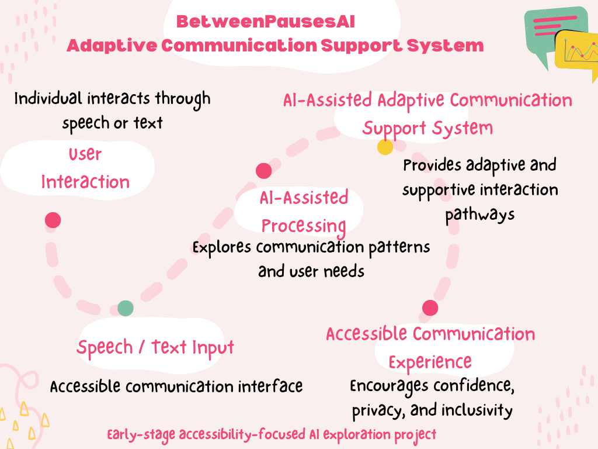
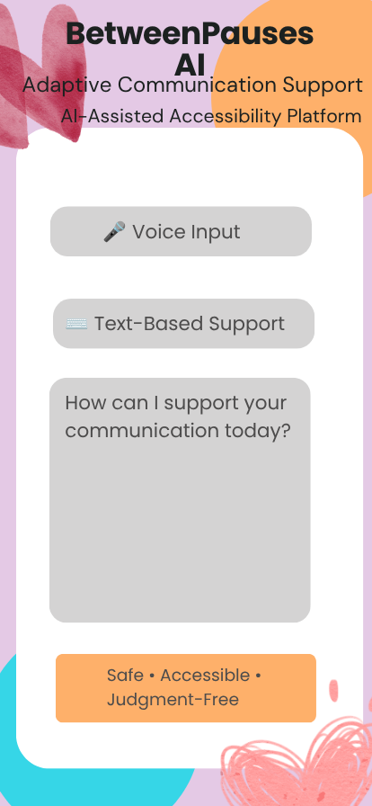

# BetweenPausesAI
AI-assisted accessibility support system exploring adaptive communication tools for individuals with speech dysfluency.

## Problem
Many individuals with speech dysfluency face not only communication difficulties, but also social stigma, lack of accessibility, and pressure to communicate fluently in environments that are not designed with patience or understanding.

## Solution
BetweenPausesAI explores how artificial intelligence and accessibility-focused design can support more comfortable and adaptive communication experiences for individuals with speech differences.

## Features
- AI-assisted chatbot communication
- Accessibility-focused interaction design
- Early-stage speech interaction prototype
- Exploration of adaptive communication support
- Privacy-conscious communication approach

## How It Works
1. User interacts through speech or text  
2. Input is processed through the AI-assisted interface  
3. The system explores communication patterns  
4. Adaptive interaction support is provided
## System Architecture

 

## Tech Stack
- Python
- Basic Machine Learning Concepts
- GitHub
- AI-assisted chatbot frameworks

  ## UI Concept Mockup

> Conceptual UI prototype designed to prioritise accessibility, emotional comfort, and communication inclusivity.

## Limitations
This project is currently in an early-stage prototype phase and is intended as an exploratory accessibility initiative rather than a clinically validated healthcare tool.

## Future Goals
- Improve accessibility-focused interface design
- Explore multilingual support
- Expand adaptive chatbot capabilities
- Continue awareness and accessibility initiatives

## Repository Status
Early-stage prototype and active exploration project

